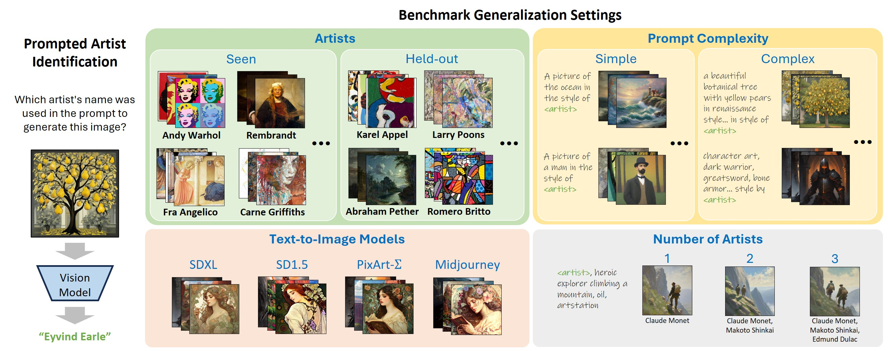

# Identifying Prompted Artist Names from Generated Images

[Grace Su](https://graceduansu.github.io/), [Sheng-Yu Wang](https://peterwang512.github.io/), [Aaron Hertzmann](https://research.adobe.com/person/aaron-hertzmann/), [Eli Shechtman](https://research.adobe.com/person/eli-shechtman/), [Jun-Yan Zhu](https://www.cs.cmu.edu/~junyanz/), [Richard Zhang](https://richzhang.github.io/) <br>
arXiv, 2025

### [Website](https://graceduansu.github.io/IdentifyingPromptedArtists/)  | [Paper](https://arxiv.org/abs/2507.18633)  | [Dataset](https://huggingface.co/datasets/cmu-gil/PromptedArtistIdentificationDataset) 


<br>
<div class="gif">
<p >

</p>
</div>

### Abstract
A common and controversial use of text-to-image models is to generate pictures by explicitly naming
artists, such as “in the style of Greg Rutkowski”. We introduce a benchmark for prompted-artist recognition: predicting which artist names were invoked
in the prompt from the image alone. The dataset contains 1.95M images covering 110 artists and spans
four generalization settings: held-out artists, increasing prompt complexity, multiple-artist
prompts, and different text-to-image models. We evaluate feature similarity baselines, contrastive style descriptors, data attribution methods,
supervised classifiers, and few-shot prototypical networks. Generalization patterns vary: supervised
and few-shot models excel on seen artists and complex prompts, whereas style descriptors transfer
better when the artist’s style is pronounced; multi-artist prompts remain the most challenging.
Our benchmark reveals substantial headroom and provides a public testbed to advance the responsible
moderation of text-to-image models. We release the dataset and benchmark to foster further
research.

## To Do:
- [ ] Dataset generation code

## Getting Started
```bash
git clone https://github.com/graceduansu/IdentifyingPromptedArtists.git
cd IdentifyingPromptedArtists
conda env create --file environment.yaml
conda activate ipa
```

## Download the Dataset 
(See the [HuggingFace dataset page](https://huggingface.co/datasets/cmu-gil/PromptedArtistIdentificationDataset) for explanations of different data splits and data fields.) <br>
First, login to HuggingFace using your [token](https://huggingface.co/settings/tokens) to download from this gated dataset:
```bash
huggingface-cli login
```

If your machine has high network bandwith, you can enable [`hf_transfer`](https://github.com/huggingface/hf_transfer) to speed up the download:
```bash
pip install huggingface_hub[hf_transfer]
export HF_HUB_ENABLE_HF_TRANSFER=1
```

### Sample Dataset
The entire benchmark dataset consists of 1.95 million images and is ~2.9TB in size. To facilitate quick testing, we provide a sample dataset of 17 GB that is structured similarly to the full dataset. The sample dataset contains 10,200 SDXL images, with half of the images generated with complex prompts and half with simple prompts. 

To download the sample dataset to the current directory and extract all images, run:
```bash
python scripts/download_dataset.py --download_config sample
```

### Full Dataset
To download the full dataset to the current directory and extract all images, run:
```bash
python scripts/download_dataset.py --download_config all
```
`--download_config` can be `sample`, `single_artist`, `multi_artist`, `all`, or `laion`. See [scripts/download_dataset.py](scripts/download_dataset.py) `parse_args()` for more details and download options.

### Dataset Location and Structure
All dataset files will be downloaded to the current directory. <br>
After downloading, the repository will be structured as follows:
```
IdentifyingPromptedArtists
├── dataset_all_sample_sdxl
│   ├── train_imgs.csv
│   ├── test_artist_imgs.csv
│   ├── ...
├── dataset_all_single_artist
│   ├── train_imgs.csv
│   ├── test_artist_imgs.csv
│   ├── ...
├── sdxl_images_easy_prompts-artist
│   ├── abraham_pether_seed0
│   │   ├── xxx.png
│   │   ├── ...
│   ├── abraham_pether_seed1
│   │   ├── xxx.png
│   │   ├── ...
│   ├── ...
├── sdxl_images_mj_prompts-artist
│   ├── abraham_pether_seed0
│   │   ├── xxx.png
│   │   ├── ...
│   ├── abraham_pether_seed1
│   │   ├── xxx.png
│   │   ├── ...
│   ├── ...
```
Directories with the `dataset_` prefix contain different subsets of the dataset. 
Each directory contains a CSV file for each of the subset's splits (`train`, `test_artist`, `test_all_unseen_query`, `test_all_unseen_support`). Each CSV file contains the image paths, labels, and train/test splits for different subsets. <br> <br>
Directories matching `*_images_*` contain the generated images for different text-to-image models and prompt types.

## Download Trained Models (optional)
### Our models
We provide the model checkpoints for the vanilla classifier and prototypical networks trained on our dataset. <br>
To download the model checkpoints to the current directory, run:
```bash
python scripts/download_models.py --download_config [DOWNLOAD_CONFIG]
```
The model checkpoints will be saved to the `trained_models/` sub-directory. <br>
If prototypical networks are downloaded, the seen and held-out artist prototype features will also be downloaded and saved to the `dataset_laion` and `dataset_laion_for_journeydb` sub-directories (Each prototype is saved as a `.npy` file inside the dataset directory used to compute it).

The `download_config` options are:
- `all`: Download all models
- `single_artist_prototypical`: Download the prototypical network trained on all single-artist prompted images
- `multi_artist_prototypical`: Download the prototypical network trained with a multi-label objective on all SDXL single-artist and multi-artist prompted images
- `single_artist_vanilla`: Download the vanilla classifier trained on single-artist prompted images

### Baselines evaluated in the paper
Please see https://github.com/learn2phoenix/CSD?tab=readme-ov-file for instructions on downloading the CSD (Contrastive Style Descriptors) model.

Please see https://github.com/peterwang512/GenDataAttribution for instructions on downloading the AbC (Attribution by Customization) models.

## Model Evaluation on Benchmark
Please see [README_evaluation.md](README_evaluation.md) for instructions on how to evaluate different models on our benchmark.

## Model Training
Please see [README_training.md](README_training.md) for instructions on how to train the prototypical network and vanilla classifier on our dataset.

### Acknowledgements
Our code and dataset is built upon the following works. We are grateful to the authors for sharing their code/dataset/model.
- Contrastive Style Descriptors (https://github.com/learn2phoenix/CSD)
- JourneyDB (https://journeydb.github.io/)
- PixArt-Sigma (https://pixart-alpha.github.io/PixArt-sigma-project/)

### BibTeX Citation
```bibtex
@article{su2025identifying,
  title={Identifying Prompted Artist Names from Generated Images},
  author={Su, Grace and Wang, Sheng-Yu and Hertzmann, Aaron and Shechtman, Eli and Zhu, Jun-Yan and Zhang, Richard},
  journal={arXiv preprint arXiv:2507.18633},
  year={2025}
}
```
